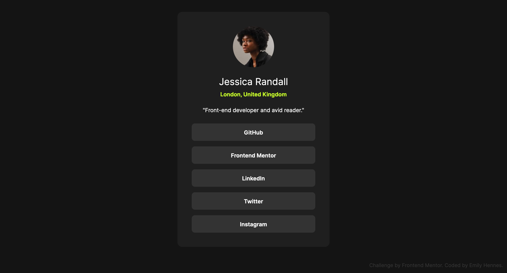

# Frontend Mentor - Social links profile solution

This is a solution to the [Social links profile challenge on Frontend Mentor](https://www.frontendmentor.io/challenges/social-links-profile-UG32l9m6dQ). Frontend Mentor challenges help you improve your coding skills by building realistic projects. 

## Table of contents

- [Overview](#overview)
  - [The challenge](#the-challenge)
  - [Screenshot](#screenshot)
  - [Links](#links)
- [My process](#my-process)
  - [Built with](#built-with)
  - [What I learned](#what-i-learned)
  - [Continued development](#continued-development)
  - [Useful resources](#useful-resources)
- [Author](#author)

## Overview

### The challenge

Users should be able to:

- See hover and focus states for all interactive elements on the page

### Screenshot

### Links

- Solution URL: 
- Live Site URL: 

## My process

### Built with

- Semantic HTML5 markup
- Tailwind CSS
- Mobile-first workflow

### What I learned

Since this was an HTML and CSS challenge, I thought it would be a good opportunity to try out Tailwind CSS for the first time. There was a learning curve with the syntax, but it was pretty intuitive and easy to pick up. I think the base functionality is very useful for projects like this one. I would be open to using Tailwind for future projects, hopefully building on my knowledge to customize the base functionality a bit more. 

### Continued development

V2 of this challenge will include: 
- My personal links and profile
- Light and dark mode 
- HTML structured more for website accessibility   

### Useful resources

- [Tailwind Documentation](https://tailwindcss.com/docs/installation) - Since this was my first time using Tailwind CSS, these docs (v3.4) were my main resource while building out this project and I found them to be very helpful.

## Author

- Website - [Emily Hennes](https://emilyhennes.dev/)
- Frontend Mentor - [@ehennes](https://www.frontendmentor.io/profile/ehennes)

